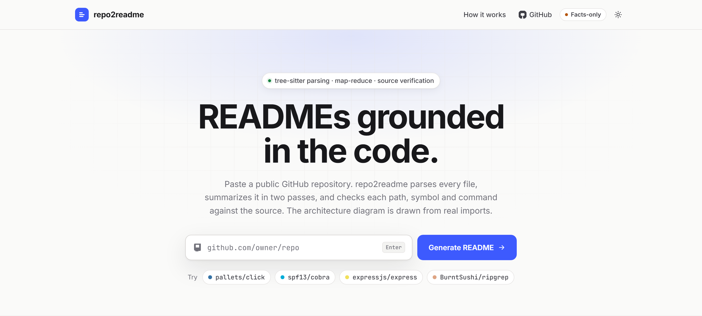

# repo2readme

[](https://github.com/aaronanish-t/repo2readme/actions/workflows/ci.yml)

Point it at a GitHub repository and it writes a README with a Mermaid architecture diagram, grounded in the code rather than guessed from file names.

**Live demo:** https://repo2readme.onrender.com

<a href="https://repo2readme.onrender.com">
  <picture>
    <source media="(prefers-color-scheme: dark)" srcset="docs/landing-dark.png">
    
  </picture>
</a>

```bash
repo2readme https://github.com/spf13/cobra -o README.md --report report.json
```

## How it works

The hard part of summarizing a large codebase is keeping the model honest once the code no longer fits in one prompt. repo2readme splits the work into deterministic extraction, a two-pass map-reduce, and verification of what comes back.

```mermaid
flowchart LR
    fetch["Shallow clone"] --> walk["Walk + classify files"]
    walk --> parse["tree-sitter: symbols, imports"]
    parse --> graph["Import graph"]
    walk --> manifests["Manifest facts: scripts, deps, env vars"]
    parse --> plan["Chunk plan"]
    plan --> map["Pass 1 (map): per-file summaries with line citations"]
    map --> vmap["Verify citations"]
    vmap --> reduce["Pass 2 (reduce): module summaries if needed, then README draft"]
    manifests --> reduce
    graph --> reduce
    reduce --> vdraft["Verify paths, symbols, commands, then one repair round"]
    vdraft --> render["Render markdown"]
    graph --> render
```

1. **Deterministic facts first.** Files are listed with `git ls-files`. Vendored, generated, binary, lockfile and housekeeping files are skipped, and symlinks are never followed. tree-sitter (via `tree-sitter-language-pack`) extracts every definition with its line span, plus imports. Imports are resolved to repo files for Python, JS/TS, Go, Rust (including workspace crates and `mod` declarations), C/C++ and dotted-path languages. Manifests give project names, scripts, binaries, dependencies, Make targets, Docker commands, the license, and every environment variable the code reads.
2. **Chunking without truncation.** Files are ranked (entrypoints and heavily imported files first; tests and docs capped to a share of the budget) and packed into chunks in path order, so each call sees neighbouring files. A file bigger than a chunk is split where a top-level definition starts. When a repo exceeds `--max-chunks`, the lowest-priority files go into the reduce pass as their parsed symbols only, and the report lists them.
3. **Map pass.** Each chunk goes to Claude with line-numbered source and the parser's symbol list. Structured output returns per-file summaries: purpose, key symbols, and facts, each citing a line range.
4. **Map verification.** Symbols must exist in that file. Facts must cite lines that were actually shown, and any identifier in backticks must appear in those lines. Anything else is dropped before the reduce pass sees it.
5. **Reduce pass.** Verified summaries are grouped by module along with the computed module import graph and manifest facts. If they fit the reduce budget, the README is written directly; otherwise modules are summarized first, then the README.
6. **Draft verification and repair.** Component, feature, structure and configuration entries that point at paths or variables that don't exist are removed. Inline code in prose is checked against paths, symbols, manifest tokens and the source text. Shell commands are checked against declared scripts, Make targets, modules and files, and CLI flags must appear in the source. Flagged mentions get one repair round, and whatever still fails is listed in the report.
7. **Diagram.** The model chooses the components; the arrows come from the import graph, aggregated between the paths assigned to each component. The diagram can't show a dependency the code doesn't have.

The existing README is never sent to the model, so a stale README can't be paraphrased back into the new one.

## Installation

Requires Python 3.12+ and `git`.

```bash
pip install -e .
```

For the web demo and tests:

```bash
pip install -e ".[web,dev]"
```

Set an Anthropic API key:

```bash
export ANTHROPIC_API_KEY=...
```

## Usage

```bash
# GitHub URL, owner/repo shorthand, or a local directory
repo2readme https://github.com/pallets/click -o README.md
repo2readme spf13/cobra --report cobra-report.json
repo2readme ./my-project

# See what would be sent to the model (no API calls, no cost)
repo2readme BurntSushi/ripgrep --dry-run

# No API key: a README built only from extracted facts (structure, import diagram, commands, env vars, license)
repo2readme pallets/click --no-model
```

| Flag | Default | Meaning |
| --- | --- | --- |
| `-o, --output` | stdout | Where to write the README |
| `--report` | none | JSON report: file counts, chunk plan, dropped claims, unverified mentions, diagram edges, token usage, estimated cost |
| `--model` | `claude-opus-5` | Claude model |
| `--map-effort` / `--reduce-effort` | `medium` / `high` | Effort level for each pass |
| `--max-chunks` | `60` | Cap on map-pass calls; controls cost on large repos |
| `--chunk-tokens` | `40000` | Estimated tokens per map chunk |
| `--concurrency` | `8` | Parallel map calls |
| `--repair-rounds` | `1` | Repair attempts for unverified mentions |
| `--dry-run` | off | Run extraction and chunk planning only |
| `--no-model` | off | Facts-only README without API calls |

Cost scales with the code that is read. Use `--dry-run` to see `estimated_map_input_tokens` before running, and lower `--max-chunks` to cap it. The shared repository context is prompt-cached across map calls: the first call runs alone to write the cache, then the rest fan out.

## Hosted demo

A FastAPI app with a single-page UI: submit a URL, watch per-stage progress, then view the rendered README, the raw markdown, and the grounding report.

```bash
uvicorn repo2readme.web.app:app --reload
```

Without `ANTHROPIC_API_KEY` the server still works: it produces facts-only READMEs and the page says so. Set the key and restart to enable the model. `python scripts/fake_server.py` runs the UI with a fake model instead, for testing the model path without cost.

The hosted configuration only accepts `github.com` URLs (never local paths), uses tighter limits (20 map chunks, 150 MB checkout, 60 s clone timeout), limits new repositories per client per hour, caps concurrent jobs, and reuses results for the same repository for an hour. Rendered markdown is sanitized with DOMPurify and Mermaid runs with `securityLevel: "strict"`, since repository content reaches the page through the model.

### Deploy

The `Dockerfile` installs `git`, prefetches common tree-sitter grammars, runs as a non-root user, and serves on `$PORT`. Any container host works.

On Render: New > Blueprint, connect this repository, and apply `render.yaml` (free plan, facts-only until a key is added). To enable the model, add `ANTHROPIC_API_KEY` under the service's Environment tab.

```bash
docker build -t repo2readme .
docker run -p 8000:8000 -e ANTHROPIC_API_KEY=... repo2readme
```

| Variable | Default | Meaning |
| --- | --- | --- |
| `ANTHROPIC_API_KEY` | unset | API key for the model calls; without it the demo is facts-only |
| `REPO2README_MODEL` | `claude-opus-5` | Model for the hosted demo |
| `REPO2README_MAX_CONCURRENT_JOBS` | `2` | Jobs running at once; the rest queue |
| `REPO2README_RATE_LIMIT_PER_HOUR` | `5` | New repositories per client per hour |
| `REPO2README_RESULT_TTL_S` | `3600` | How long a finished result is reused |
| `REPO2README_TRUST_PROXY` | `0` | Use `X-Forwarded-For` for client identity (set to `1` behind a proxy) |

## Project structure

| Path | Description |
| --- | --- |
| `src/repo2readme/fetch.py` | GitHub URL validation, shallow clone, size limits |
| `src/repo2readme/walk.py` | File discovery and role classification |
| `src/repo2readme/parse.py` | tree-sitter symbol and import extraction |
| `src/repo2readme/graph.py` | Import resolution and the dependency graph |
| `src/repo2readme/manifests.py` | Scripts, dependencies, env vars, license |
| `src/repo2readme/chunk.py` | File priority, splitting, chunk packing |
| `src/repo2readme/llm.py` | Claude structured-output client, usage and cost accounting |
| `src/repo2readme/prompts.py` | Prompts for each stage |
| `src/repo2readme/schemas.py` | Structured output schemas |
| `src/repo2readme/verify.py` | Grounding checks for map output and the README draft |
| `src/repo2readme/pipeline.py` | Orchestration of both passes |
| `src/repo2readme/diagram.py` | Mermaid diagram from components and import edges |
| `src/repo2readme/render.py` | Markdown assembly |
| `src/repo2readme/facts_only.py` | README from extracted facts alone, used when no model is configured |
| `src/repo2readme/cli.py` | Command-line interface |
| `src/repo2readme/web/` | FastAPI app and demo page |
| `tests/` | Unit tests and an end-to-end test with a fake model that injects hallucinations |

## Development

```bash
pytest
```

The end-to-end test runs the whole pipeline against a fixture repo with a fake model that returns a mix of correct claims and invented ones (nonexistent symbols, citations that don't match, fake paths, env vars, scripts and flags). It asserts that the invented ones never reach the README.

## Limitations

- Import resolution is heuristic. Path aliases beyond `@/` and `~/`, Python namespace-package tricks, and languages without a resolver can leave edges out of the diagram. Missing edges are possible; invented ones are not.
- Grounding checks catch fabricated names, paths, commands and citations. They can't prove a prose sentence about behaviour is correct when it names nothing checkable.
- Token counts used for chunk planning are estimates (characters / 3); actual usage is reported from the API response.
